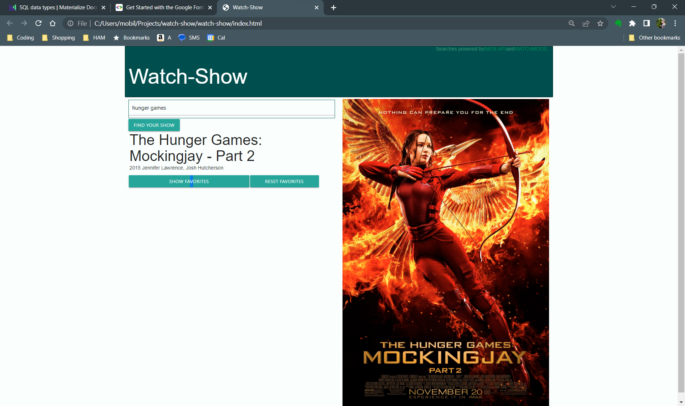

# watch-show

https://jberger2992.github.io/watch-show/

https://github.com/jberger2992/watch-show.git

Created by: Josh Berger, John Persem, Jason Johnson
4/12/2023 live 4/13/2023

Languages: HTML, CSS, JS, Materialize
APIs: IMDB, Watchmode

User Story: 

As a frequent viewer of streaming TV shows, I would like to receive information about the release date of the upcoming episode of my favorite show. This will enable me to plan for a sick day or adjust my schedule accordingly.

Acceptance Criteria:

Given a show dashboard with form inputs and a history of past searches,
When I enter the name of a TV show,
Then I should be presented with a list of matching shows.
When I select the show I am interested in,
Then I should be presented with the platforms where the show is available
The date of the last released version of the show
An image of the show
The date and the number of days until the next episode airs.

Additionally, my search should be saved in the search history.

After I make an initial search,
Then I should be able to select the desired show from my search history, making it quicker to get to the show I want if I have searched for it previously.

Additional Information:

The site will have dynamic background coloring that matches the show image.

Ideas for Future Updates:

Add time (based on the user's location) instead of just the day.
Allow for unlimited search history.
Add an alarm/notification or CAL+ functionality.
Auto-create a printable calendar with search history results.